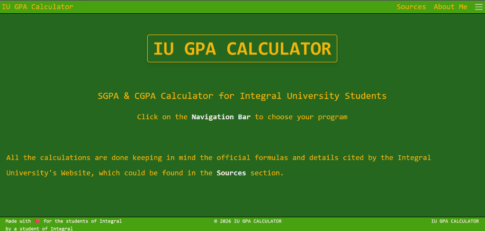
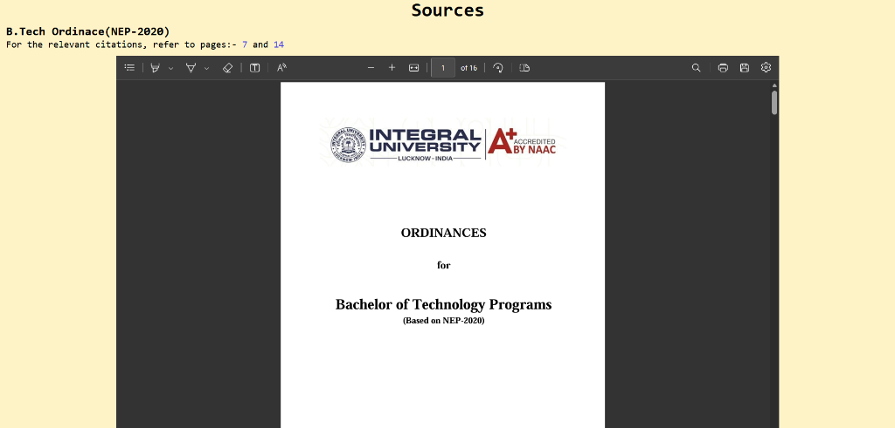

<div align="center">

# 🎓 IU GPA Calculator

### SGPA & CGPA Calculator for Integral University Students

[](https://github.com/ArshilTech/IU-GPA-Calculator)
[](https://react.dev/)
[](https://vite.dev/)
[](https://tailwindcss.com/)
[](LICENSE)

*Made with ❤️ for the students of Integral University, by a student of Integral*

<br>



</div>

---

## 📋 Table of Contents

- [About](#-about)
- [Features](#-features)
- [Screenshots](#-screenshots)
- [Tech Stack](#-tech-stack)
- [Getting Started](#-getting-started)
- [Project Structure](#-project-structure)
- [How It Works](#-how-it-works)
- [Roadmap](#-roadmap)
- [Contributing](#-contributing)
- [Acknowledgements](#-acknowledgements)
- [Author](#-author)

---

## 💡 About

**IU GPA Calculator** is a web-based tool designed specifically for **Integral University, Lucknow** students to calculate their **SGPA** (Semester Grade Point Average) and **CGPA** (Cumulative Grade Point Average) effortlessly.

All calculations are performed using the **official formulas and grading criteria** as outlined in the university's **B.Tech Ordinance (NEP-2020)** — no guesswork, no approximations.

> 🎯 **Why this exists:** Manually calculating GPA from mark sheets can be tedious and error-prone. This tool automates the process with a clean, easy-to-use interface tailored to IU's exact grading system.

---

## ✨ Features

| Feature | Description |
|---------|-------------|
| 🧮 **SGPA Calculator** | Calculate your Semester GPA based on course credits and grades |
| 📊 **CGPA Calculator** | Compute your Cumulative GPA across multiple semesters |
| 🎯 **Program-Specific** | Support for multiple B.Tech programs (CSE, DSAI, CCAI, AIML) |
| 📄 **Official Sources** | Embedded B.Tech Ordinance (NEP-2020) PDF for reference |
| 📱 **Responsive Design** | Works seamlessly across desktop and mobile devices |
| ⚡ **Fast & Lightweight** | Built with Vite for blazing-fast load times |

---

## 📸 Screenshots

<div align="center">

### 🏠 Homepage


<br><br>

### 📄 Sources & Citations


</div>

---

## 🛠️ Tech Stack

<div align="center">

| Technology | Purpose |
|:----------:|:--------|
|  **React 19** | Component-based UI framework |
|  **Vite 7** | Next-gen frontend build tool |
|  **Tailwind CSS 4** | Utility-first CSS framework |
|  **JavaScript (ES6+)** | Core application logic |

</div>

---

## 🚀 Getting Started

### Prerequisites

- [Node.js](https://nodejs.org/) (v18 or higher)
- [npm](https://www.npmjs.com/) or [yarn](https://yarnpkg.com/)

### Installation

1. **Clone the repository**
   ```bash
   git clone https://github.com/ArshilTech/IU-GPA-Calculator.git
   cd IU-GPA-Calculator
   ```

2. **Install dependencies**
   ```bash
   npm install
   ```

3. **Start the development server**
   ```bash
   npm run dev
   ```

4. **Open your browser** and navigate to `http://localhost:5173`

### Build for Production

```bash
npm run build
npm run preview
```

---

## 📁 Project Structure

```
IU-GPA-Calculator/
├── public/
│   ├── B.Tech Ordinance(NEP-2020).pdf    # Official university ordinance
│   └── Sources.html                       # Sources & citations page
├── src/
│   ├── assets/
│   │   └── Logo.png                       # App logo/favicon
│   ├── App.jsx                            # Root application component
│   ├── Navbar.jsx                         # Navigation bar with program selector
│   ├── Hero.jsx                           # Landing page hero section
│   ├── Footer.jsx                         # Footer component
│   ├── Dropdown.js                        # Dropdown toggle utility
│   ├── index.css                          # Global styles
│   └── main.jsx                           # React entry point
├── docs/
│   └── screenshots/                       # README screenshots
├── index.html                             # HTML entry point
├── vite.config.js                         # Vite configuration
├── package.json                           # Dependencies & scripts
└── README.md                              # You are here! 📍
```

---

## 🔢 How It Works

The calculator follows the grading system defined in the **Integral University B.Tech Ordinance (NEP-2020)**:

### Grade Point Scale

| Grade | Grade Points | Marks Range |
|:-----:|:------------:|:-----------:|
| O     | 10           | 90–100      |
| A+    | 9            | 80–89       |
| A     | 8            | 70–79       |
| B+    | 7            | 60–69       |
| B     | 6            | 55–59       |
| C     | 5            | 50–54       |
| P     | 4            | 45–49       |
| F     | 0            | Below 45    |

### Formulas

**SGPA** = Σ (Credit × Grade Point) / Σ Credits

**CGPA** = Σ (SGPA × Semester Credits) / Σ Total Credits

> 📖 For the official documentation, refer to **pages 7 and 14** of the [B.Tech Ordinance (NEP-2020)](public/B.Tech%20Ordinance(NEP-2020).pdf).

---

## 🗺️ Roadmap

> 🚧 This project is currently under active development!

- [x] Landing page with hero section
- [x] Navigation bar with program selection dropdown
- [x] Sources page with embedded ordinance PDF
- [x] Responsive footer
- [ ] SGPA calculation engine for B.Tech CSE
- [ ] CGPA calculation engine
- [ ] Support for B.Tech CSE (DSAI)
- [ ] Support for B.Tech CSE (CCAI)
- [ ] Support for B.Tech CSE (AIML)
- [ ] Semester-wise subject selection
- [ ] Grade input form with validation
- [ ] Result display with visual charts
- [ ] Export results as PDF
- [ ] Dark mode toggle
- [ ] GPA history tracking (local storage)

---

## 🤝 Contributing

Contributions, issues, and feature requests are welcome! If you're an IU student and want to help improve this tool:

1. **Fork** the repository
2. **Create** a feature branch (`git checkout -b feature/amazing-feature`)
3. **Commit** your changes (`git commit -m 'Add amazing feature'`)
4. **Push** to the branch (`git push origin feature/amazing-feature`)
5. **Open** a Pull Request

---

## 🙏 Acknowledgements

- **Integral University, Lucknow** — for providing the official B.Tech Ordinance (NEP-2020) documentation
- **React** and **Vite** communities for excellent developer tooling
- All IU students who inspired this project

---

## 👨‍💻 Author

<div align="center">

**Arshil Masood**

B.Tech CSE Student | Integral University, Lucknow

[](https://www.linkedin.com/in/arshil-masood-061386308)
[](https://github.com/ArshilTech)

</div>

---

<div align="center">

**⭐ If you find this helpful, consider giving it a star! ⭐**

© 2026 IU GPA Calculator

</div>
